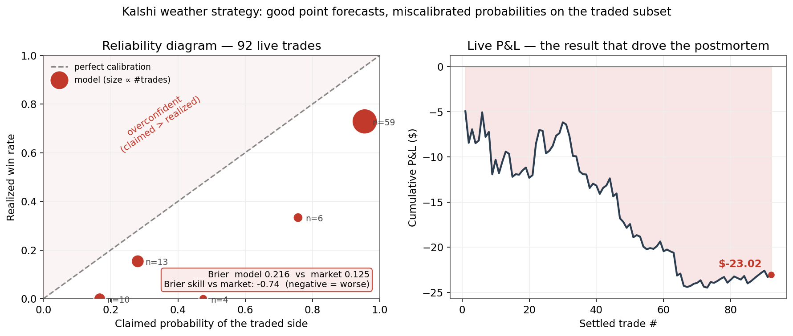

# Kalshi Weather Trading System

An end-to-end automated trading system for Kalshi daily-high-temperature
markets: multi-model ensemble forecasting, ML bias correction, calibrated
probability estimation, Bayesian shrinkage against the market prior,
fractional-Kelly execution, and a self-validating second strategy — with full
live trade logging and an honest quantitative postmortem of real-money results.

**Read [RESEARCH.md](RESEARCH.md) first** — a postmortem of 89 live trades
covering winner's-curse diagnosis, proper-scoring-rule benchmarking against
market prices, and the structural fixes that followed. The negative result and
its analysis are the most interesting part of this project.



*The whole project in one chart (92 settled trades — the postmortem analyzed the
first 89; the three that settled later left the conclusion unchanged). Left: the
model's probabilities sit below the diagonal — overconfident — and score a worse
Brier (0.22) than the market-implied price (0.13), a −0.74 skill score. Right:
the resulting −$23 P&L. The point forecasts were good (live MAE 1.4°F); the edge
died in the probability layer under adverse selection. Regenerate with
`python make_figures.py`; the underlying trades are in [`data/live_trades.csv`](data/live_trades.csv).*

## Highlights

- **Probabilistic forecasting & calibration.** Per-city Lasso/Ridge correction
  models over a GFS/ECMWF/blend ensemble (live MAE 1.36–1.54°F, beating every
  individual source). Probability layer recalibrated continuously from live
  verified errors; calibration tracked with reliability tables, Brier score,
  log loss, and a skill score against the market-implied baseline.
- **Adverse-selection-aware trade selection.** Live data showed losses
  concentrated where model-market disagreement was largest (the winner's
  curse). Trades use shrinkage `p̂ = w·model + (1−w)·price` and a credibility
  filter that refuses trades beyond 25¢ of disagreement.
- **Risk management.** Fractional Kelly (15%) with balance-aware caps,
  per-trade/per-run dollar limits, orderbook depth and spread filters,
  position de-duplication, file-based kill switch with auto-engage on
  repeated order failures.
- **Walk-forward methodology.** Time-series CV for model selection (no
  lookahead), walk-forward backtester, and a live self-learning loop that
  verifies yesterday's predictions, appends them to the training set, and
  retrains daily.
- **Two edge hypotheses, tested separately.** (1) Next-day forecasting edge —
  tested live, found ≈ zero against same-information market makers, documented.
  (2) Same-day attention/latency edge from real-time settlement-station
  observations vs stale quotes — currently in self-validating dry-run: it
  trades live only after ≥15 verified signals demonstrate positive EV and
  honest calibration.

## Architecture

```
┌─────────────────────────────────────────────────────────────────┐
│                  Daily Pipeline (7:00 launchd)                   │
│                                                                  │
│  Weather APIs ──▶ Ensemble + ML ──▶ Shrinkage vs ──▶ Kelly      │
│  GFS/ECMWF/NWS    correction        market prior     execution  │
│                   + live σ/bias     + credibility    + orderbook│
│                   recalibration       filter           filters  │
│                                                                  │
├─────────────────────────────────────────────────────────────────┤
│              Self-Learning Loop (same run)                       │
│  verify yesterday ──▶ append to training set ──▶ retrain        │
├─────────────────────────────────────────────────────────────────┤
│         Same-Day Sniper (hourly 12:20–19:20 launchd)            │
│  settlement-station obs ──▶ Monte Carlo final-high ──▶ trade    │
│  (KMDW/KNYC/KMIA)           distribution               near-    │
│                             gated by self-validation  certainty │
└─────────────────────────────────────────────────────────────────┘
```

| File | Purpose |
|------|---------|
| `weather_ensemble.py` | Multi-model ensemble + live σ/bias recalibration |
| `train_model.py` | Feature engineering, time-series CV model selection, residual calibration |
| `model.py` | Contract parsing, Normal probability model |
| `find_edge.py` | Market-prior shrinkage, credibility filter, edge signals |
| `orderbook.py` | Depth, spread, slippage analysis |
| `trader.py` | Fractional Kelly sizing, limit-order execution, safety caps |
| `sniper.py` | Same-day observation-driven strategy with self-validation gate |
| `daily_learner.py` | Verify → append → retrain loop |
| `pnl_tracker.py` | Trade log, settlement checks, calibration & proper scoring report |
| `backtest.py` | Walk-forward backtester |
| `scheduler.py` | Orchestration, kill switch, budget management |
| `dashboard_app.py` | Flask monitoring dashboard (P&L, positions, calibration, kill switch) |
| `kalshi_client.py` | Kalshi REST client (RSA-PSS request signing) |

## Model details

**Features (16):** raw GFS/ECMWF/blend forecasts; ensemble mean and spread;
pairwise model differences; month and sin/cos day-of-year; wind, humidity,
cloud cover; per-model rolling 3-day error trends (shifted to avoid lookahead).

**Selection:** Ridge / Lasso / ElasticNet / GBM / RF compared by 5-fold
time-series CV MAE per city. Regularized linear models win consistently —
the forecast features are highly collinear.

**Probability layer:** `actual ~ Normal(prediction − live_bias, σ_live)`, with
σ and bias estimated from the last 30 live verified errors (clipped bias
±1.5°F, σ floor 1.8°F), spread-inflation for model disagreement, and
probability clamps to prevent phantom tail edges.

**Trade selection:** blended probability `0.5·model + 0.5·market`, minimum 7¢
blended edge (⇒ 14¢ raw gap), credibility filter at 25¢, bracket-YES bets
disallowed, price floors per side. Rationale and evidence in
[RESEARCH.md](RESEARCH.md) §3.

## Live results (the honest part)

89 settled trades, May 6 – June 11, 2026: **−$22.86** on ~$120 staked.
Diagnosis: point forecasts were good; probabilities were overconfident *on the
traded subset* due to selection effects, and the market was the better
probability forecaster (Brier skill −0.76 on traded contracts). The entire
loss sat in trades with >25¢ model-market disagreement. Full analysis,
including why the retrospective +ROI of the new rules must be discounted as
in-sample, in [RESEARCH.md](RESEARCH.md).

`python pnl_tracker.py calibration` reproduces the reliability table and
scoring metrics from the live trade log at any time.

## Setup

```bash
python -m venv venv && source venv/bin/activate
pip install -r requirements.txt

# Kalshi API auth (RSA key pair)
openssl genrsa -out kalshi_private_key.pem 2048
openssl rsa -in kalshi_private_key.pem -pubout -out kalshi_public_key.pem
# upload public key at kalshi.com/account/api, then:
cp config.example.py config.py   # add your API key id + key path

# Bootstrap training data and models
python historical_data.py chicago --days 365   # repeat per city
python train_all_cities.py

python scheduler.py run --dry-run    # verify pipeline
bash setup_schedule.sh               # daily 7am trading via launchd
bash setup_sniper.sh                 # hourly afternoon sniper (starts dry)
python dashboard_app.py              # monitoring at localhost:5050
```

## CLI reference

```bash
python scheduler.py run [--dry-run] [--max-spend N]   # main strategy
python scheduler.py --kill | --resume | --status      # kill switch
python sniper.py run [--auto|--live] [--city X]       # same-day strategy
python sniper.py report                               # validation gate status
python backtest.py --all --chart                      # walk-forward backtest
python pnl_tracker.py summary|daily|calibration       # performance & scoring
python find_edge.py chicago --show-all                # model vs market table
python train_all_cities.py                            # retrain models
```

## Known limitations

1. **No information asymmetry in next-day markets** — market makers see the
   same public model runs; live results confirmed ≈ zero modeling edge there.
2. **Thin markets** — 5–10¢ spreads and shallow depth cap capacity at tens of
   dollars/month regardless of edge quality.
3. **Backtest ≠ live** — the backtester's simulated market is deliberately
   naive; it validates predictive skill vs a baseline, not dollar returns.
4. **Small samples everywhere** — 89 trades, ~30 verified days per city;
   every conclusion carries wide confidence intervals, which is why the
   sniper gates itself before risking capital.

## Stack

Python · scikit-learn · scipy · numpy · pandas · SQLite · Flask · launchd ·
Kalshi REST API (RSA-PSS) · NWS / Open-Meteo APIs
